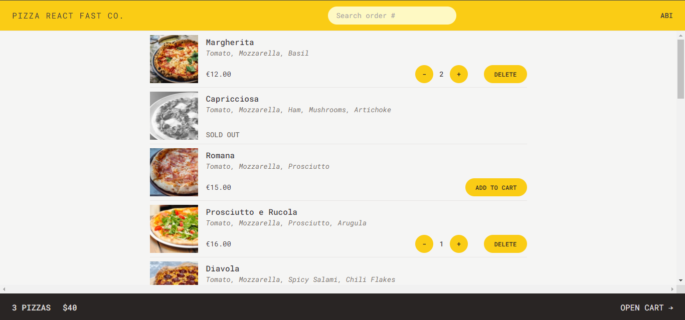
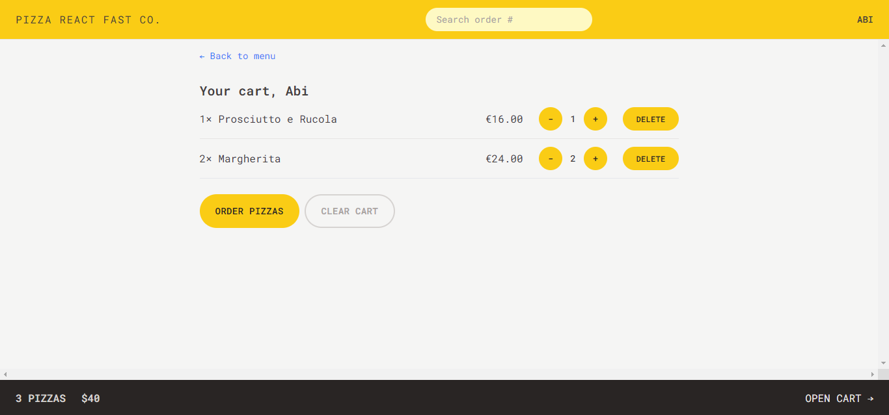
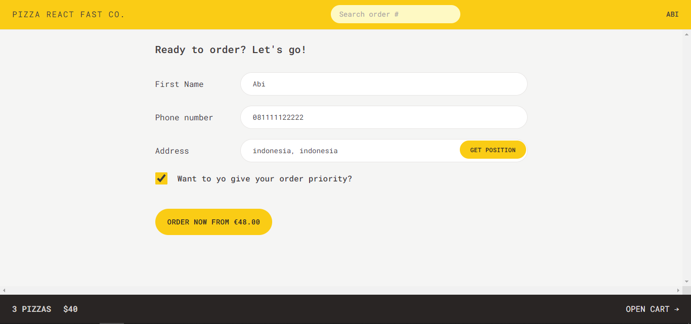
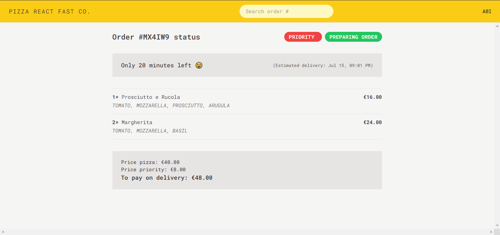

# Fast React Pizza

This project based on React Udemy Course by Jonas Schmedtmann. [(Master modern React from beginner to advanced! Next.js, Context API, React Query, Redux, Tailwind, advanced patterns)](https://www.udemy.com/course/the-ultimate-react-course/)

## Daftar Isi

- [Overview](#overview)
  - [The challenge](#the-challenge)
  - [Screenshot](#screenshot)
  - [Links](#links)
- [My process](#my-process)
  - [Built with](#built-with)
  - [What I learned](#what-i-learned)
  - [Useful resources](#useful-resources)
- [Author](#author)

## Overview

### Penjelasan Project

This repository hosts a simple web application for ordering pizzas online. It allows users to select pizzas from a dynamic menu fetched from a remote API, add them to a cart, specify delivery details, and optionally mark their order as a priority for expedited service.

### Screenshot

**Tampilan Desktop**

### Links

- Solution URL: [Solution Code](https://github.com/abimh66/fast-react-pizza)
- Live Site URL: [Live Site](https://fast-react-pizza-abimh66.netlify.app/)

## My process

### Built with

- ReactJS
- React Router
- Redux
- Tailwind CSS Framework
- Mobile-first workflow

### What I learned

Through this project, I acquired valuable skills and knowledge in several areas:

- **Project Planning**: I learned how to effectively plan and organize a React project from start to finish, including defining requirements, creating a project timeline, and setting achievable milestones.
- **Project Structure**: I gained experience in structuring a React application, organizing components, modules, and assets in a scalable and maintainable manner.

- **Redux for UI State Management**: I implemented Redux to manage complex UI state across different components of the application. This included handling global state such as cart items and user preferences seamlessly throughout the app.

- **React Router for Routing and API Handling**: I utilized React Router to implement navigation and dynamic routing within the application. I also integrated it with API calls to fetch data from a remote server and update the UI accordingly.

- **Responsive Design with Tailwind CSS**: I leveraged Tailwind CSS to create a responsive and visually appealing user interface. This involved using Tailwind's utility-first approach to efficiently style components and ensure consistent design across various screen sizes.

These learnings not only enhanced my technical proficiency in React development but also improved my overall understanding of modern web development practices and tools.

### Resources

- [React Documentation](https://react.dev/reference/react)
- [React Router v6.4+ Documentation](https://reactrouter.com/en/main/start/overview)
- [Redux Documentation](https://redux.js.org/introduction/getting-started)
- [Tailwind CSS Documentation](https://tailwindcss.com/docs/installation)

## Author

- Twitter - [@abimhrdnt](https://www.twitter.com/abimhrdnt)
- Frontend Mentor - [@abimh66](https://www.frontendmentor.io/profile/abimh66)
- Codewars - [@abimh66](https://www.codewars.com/users/abimh66)
